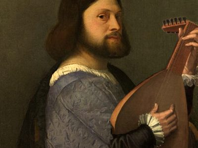

---
hide:
  - title
  - navigation
---

# Projects

---

## [Oddities & Rarities (2024)](./projects/oddities_and_rarities_2024.md)

  {align=left width="300" height="300"} Western Europe experienced a trend of Orientalist and Exotic art in the late 19th and early 20th centuries, which generated a large cultural, and especially musical, body of work. However, today this repertoire is bathed in questionable waters, with which Imperialism, Colonialism and cultural appropriation are associated. The project wishes to propose a way to deal with this as musicians and as audiences. [_Read more_](./projects/oddities_and_rarities_2024.md) 

 

## [Sprezzanti Rime](./projects/sprezzanti_rime.md)

{align=left width="300" height="300"} The theme of femininity, so dear to our ensemble, once again plays a princely role: the vicissitudes of female poets of sixteenth-century Italy are recounted through their sonnets, octaves and third rhymes, set to music by contemporary artists. [_Read more_](./projects/sprezzanti_rime.md) 

## [Sketches of Arcadia](./projects/sketches_of_arcadia.md)

{align=left width="300" height="300"} 18th century London was probably the place to be for artists and performers looking for a wealthy patron. The rising wealth of the British middle class created a vast market for leisure, such as theater plays, novels and most of all music entertainment. Many Italians of the time, such as the composers Giovanni Bononcini, Nicola Porpora and Attilio Ariosti, were seeking fortune and fame in the sparkling Northern European metropolis, a fate still shared nowadays by many expats of the _Bel Paese_. [_Read more_](./projects/sketches_of_arcadia.md)

## [La Predica del Sole](./projects/predica_del_sole.md)

{align=left width="300" height="300"} Galilei's conflict with the Roman Catholic Church, which in 1633 required him to deny his belief in heliocentrism and place him under house arrest, has become a popular archetype for the conflicting historical relationship between science and faith. [_Read more_](./projects/predica_del_sole.md)

## [Discanting the Classics](./projects/discanting_the_classics.md)

{align=left width="300" height="300"} We would like to take you into the minds of 16th century people and their relationship to Roman and Greek classics. How did they interpret these classical texts, this ancient, lost music? [_Read more_](./projects/discanting_the_classics.md)

## [Madrigali Ariosi](./projects/madrigali_ariosi.md)

{align=left width="300" height="300"} One of the missing links in the stylistical evolution of the 16th century is the so-called arioso madrigal. The name itself presents a paradox: how can a madrigal, that is a representation in music of secular poetry in polyphonic style, bear traits of an aria, associated with solistic singing? In our concert program Madrigali Ariosi we recount the love affairs of the many characters in the Orlando Furioso, through various compositions of this particular musical genre. [_Read more_](./projects/madrigali_ariosi.md)

## [Caffè Cantata](./projects/caffe_cantata.md)

{align=left width="300" height="300"} Contrary to the success gained by the madrigal and opera, since the music revival in the past century, the cantata is still nowadays considered the black sheep of Early Music. The project Caffè Cantata aims to bring the listener closer to this unique genre through a series of short concerts, showing its adaptation spirit in different cultures and social contexts. [_Read more_](./projects/caffe_cantata.md)

## [Heliopolis](./projects/heliopolis.md)

{align=left width="300" height="300"} Heliopolis, the city of the sun, is a place where the golden rays of Art enlighten society against the shadows of fear and oppression.  In our music program we guide you through the youth of Franz Schubert and his friends in their fight for Honour, Freedom and Fatherland.  [_Read more_](./projects/heliopolis.md)

## [Le Donne Antique](./projects/donne_antique.md)

{align=left width="300" height="300"} In our concert program Le Donne Antique (women from the past) we present music from the first half of 16th century Ferrara. We juxtapose the court music to the convent music and investigate, through an imaginary correspondence between Leonora d’Este and her niece Anna...  [_Read more_](./projects/donne_antique.md)

## [L'Amorosa Filosofia](./projects/amorosa_filosofia.md)

{align=left width="300" height="300"} Guided by the life of perhaps the most important female musician of her generation, Tarquinia Molza, we explore the web of female musicians who were active in courts and cities of Northern Italy throughout the second half of the 16th century...  [_Read more_](./projects/amorosa_filosofia.md)

## [Santa Editta](./projects/santa_editta.md)

{align=left width="300" height="300"} Numerous writers and musicians have been inspired by the eccentric Italian composer Alessandro Stradella, since he was murdered in Genoa under obscure circumstances...  [_Read more_](./projects/santa_editta.md)

