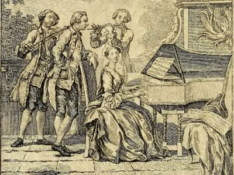

---
hide:
  - title
  - navigation
---

# Title

{align =left}

Contrary to the success gained by the madrigal and opera, since the music revival in the past century, the cantata is still nowadays considered the black sheep of Early Music. It combines the polyphonic and monodic styles enhanced by the dramatic power of the theatrical representation.
This mixture of genres led the composers of 17th and 18th century Europe to fruitful experiments. Yet precisely this multiform nature makes the cantata difficult to grasp for the contemporary public and performers.

The project Caffè Cantata aims to bring the listener closer to this unique genre through a series of short concerts, showing its adaptation spirit in different cultures and social contexts.

### The Dark Side of the Sun: Antonia Bembo at the court of Louis XIV

The charming life of the Venetian musician Antonia Bembo (c. 1640-1720) is still clouded in shadows. What we are sure about is her artistic contribution in uniting the Italian and French musical traditions: les goûts réunis, citing François Couperin. This concert aims to shed light on the relation of Antonia with the Parisian artistic entourage at the court of the Roi Soleil.

### [Sketches of Arcadia](sketches_of_arcadia.md): The Italian Manner and 18th century London

18th century London was probably the place to be for artists and performers looking for a wealthy patron. Thanks to its navy and a crescent colonial and industrial influence, England was becoming a leading power in European and global politics. The rising wealth of the British middle class created a vast market for leisure, such as theater plays, novels and most of all music entertainment.  

Many Italians of the time, such as the composers Giovanni Bononcini, Nicola Porpora and Attilio Ariosti, were seeking fortune and fame in the sparkling Northern European metropolis, a fate still shared nowadays by many expats of the Bel Paese.

## Performers

- Patrick Beukels, transverse flute
- Nicholas Cornia, artistic director
- Florian Heyerick, harpsichord
- Dirk Moelants, viola da gamba
- Jana Pieters, soprano
- Arina Tsytlenok, transverse flute
- Lidwien Van Winckel, soprano
- Veera Voordeckers, harpsichord

## Media

<iframe width="560" height="315" src="https://www.youtube.com/embed/videoseries?si=FxBabSQKdLH_0WUM&amp;list=PLDTXvtcLnrvHlwguKgqVOmX6XpxSJc_6G" title="YouTube video player" frameborder="0" allow="accelerometer; autoplay; clipboard-write; encrypted-media; gyroscope; picture-in-picture; web-share" referrerpolicy="strict-origin-when-cross-origin" allowfullscreen></iframe>

