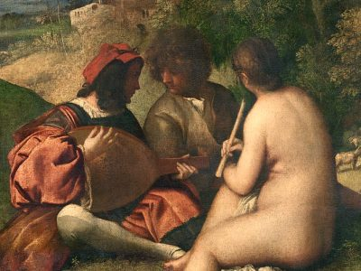

---
hide:
  - title
  - navigation
---

# Discanting the Classics

{align =left}

Vandaag de dag hebben we het geluk omringd te zijn door een groot repertoire aan klassieke teksten. Dagelijks ontdekken leerlingen, cursisten en liefhebbers de kracht van de literatuur van de oudheid. We kijken met bewondering naar de kunst binnen deze teksten, zowel in inhoud als in samenstelling, en we vertellen op onze beurt opnieuw hun verhalen verder. Deze verwondering was niet anders bij de Italianen van de 16e eeuw. Hoewel het Latijn voor hen nooit veraf was geweest, toch trad er binnen de Renaissance een nieuwe belangstelling op voor het materiaal waarmee ze al eeuwenlang de enkel Latijnse grammatica bestudeerden. Latijn was voor hen een gebruikstaal maar tegelijk ook de moeder van hun eigen Italiaans, net zoals hun geschiedenis van Rome en omstreken vervlochten was met de vele overblijfselen van die afgebrokkelde samenleving. 

Vanuit de architectuur en beeldhouwkunst vonden ze concrete voorbeelden om onderzoek naar te doen en te incorporeren in hun eigen stijl. Binnen de literatuur bestudeerden ze nu ook de inhoud en de opbouw van hun grammaticale leermeesters. Dichters als Francesco Petrarca en Pierre de Ronsard kwamen op voor hun eigen moedertaal, weg van het Latijn, maar konden het niet laten om hun eigen poëzie te doorspekken met verwijzingen naar Ovidius en Horatius. De humanisten zochten naar hun plaats in relatie tot de oudheid en diens erfenis. 

Deze evolutie was niet anders voor de muziek. Toch hadden de andere kunsten een voordeel binnen deze heropleving: zij hadden fysieke voorbeelden. Tempels, beelden en gekopieerde manuscripten konden onderzocht worden, de oude muziek van weleer bleef echter stil en verborgen. Dit hield de humanisten van de renaissance niet tegen om zelf een gooi te doen naar de heropleving van de oudheid in de muziek. 

Le Vecchie Musiche, een artistieke organisatie met een hart voor de onontgonnen parels van de muziekgeschiedenis, willen u nu graag in Discanting the Classics meenemen naar de 16e eeuw en hun relatie tot de klassieken. Wij bieden u een avondvullend concert aan van herontdekte muziek, omkaderd door bindteksten die ook dit historisch verhaal vertellen. Hoe behandelen de mensen van de 16e eeuw deze klassieke teksten, deze oude, verloren muziek? Hoe gaan wij als 21ste eeuwers om met een geschiedenis van experiment en van zoeken? 

## Performers

- [Nicholas Cornia](../members/nicholas_cornia.md), artistic director
- Mieke Dhondt, zang
- Thomas Langlois, luit

## Media

<iframe width="560" height="315" src="https://www.youtube.com/embed/videoseries?si=S8Xh1yeesssxuT2x&amp;list=PLDTXvtcLnrvF54nRi7pxrI9j5gBQc3Wpp" title="YouTube video player" frameborder="0" allow="accelerometer; autoplay; clipboard-write; encrypted-media; gyroscope; picture-in-picture; web-share" referrerpolicy="strict-origin-when-cross-origin" allowfullscreen></iframe>

