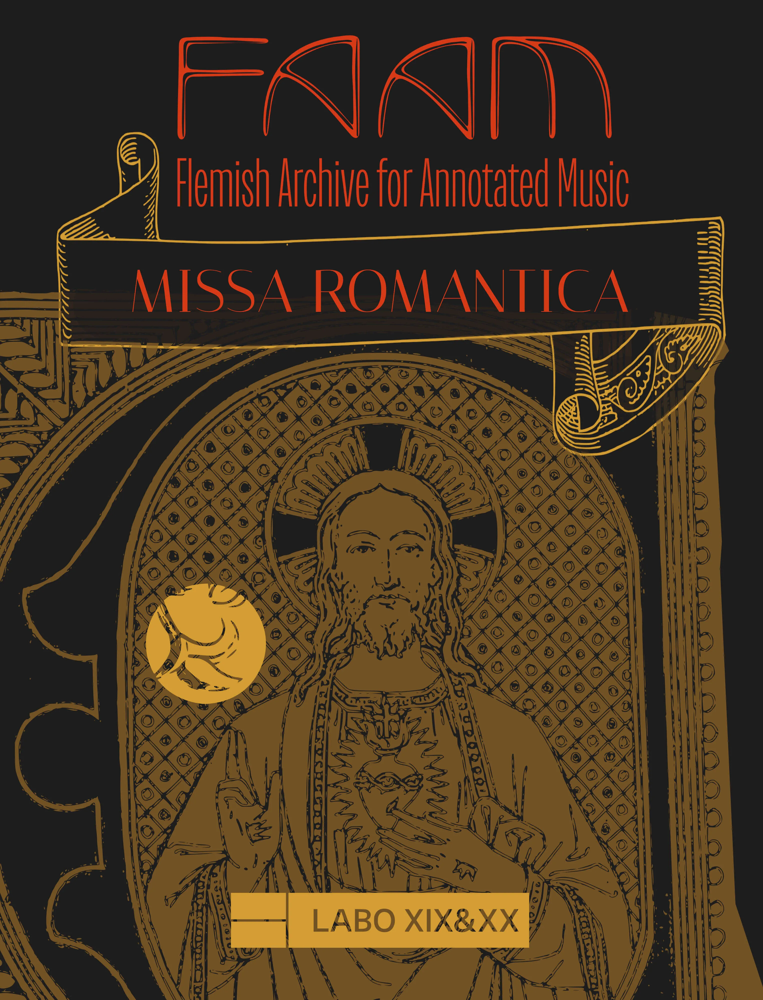

---
hide:
  - title
  - navigation
---

# Missa Romantica

<!--{align =left width=30% height=30%} -->

Ben jij benieuwd naar de interpretatie van Richard Wagner van Palestrina’s muziek?
 
Neem dan deel aan onze tweedaagse workshop in samenwerking met dirigent Florian Heyerick, waar we enkele koorwerken uit de renaissance zullen zingen volgens edities uit de 19de en vroege 20ste eeuw, die de geest van de zogenoemde “Sint-Cecilia beweging” weerspiegelen. De bedoeling van het weekend is om samen de muziek van Palestrina, Vittoria, Lassus en hun tijdgenoten weer te laten klinken zoals de romantici ze voorstelden. Dit bijzondere project biedt zo een unieke kans om de geschiedenis van onze koortraditie beter te leren begrijpen.
 
Onder leiding van dirigent Florian Heyerick bereiden de deelnemers een openbaar toonmoment voor op zondag 18 mei om 15u. De winsten van het concert, via vrije bijdragen van het publiek, zullen geschonken worden aan de Gentse organisatie Het Majin Huis.
 
Deze activiteit wordt georganiseerd in samenwerking met [Ex Tempore](http://www.heyerick.org/) en het ensemble [Le Vecchie Musiche](https://www.vecchiemusiche.be).

## Praktish

We musiceren tijdens het weekend van 17-18 mei 2025 in het Gentse Coletienenklooster, Sint-Elisabethplein 13. 
 
- Zaterdag 10u – 18u
- Zondag 10u – 16.30u
 
Het volledige repertoire wordt elektronisch gedeeld voor de paasvakantie. 
 
**Inschrijvingskosten:** 30 euro, inclusief lunch op zaterdag en zondag, koffie en thee.
 
Heb jij interesse om mee te doen? Graag **[dit formulier](https://forms.gle/jSmLt7qgDPCrQEDF8)** invullen tegen zaterdag 16 februari.
 
Jij helpt ons dit project waar te maken door deze uitnodiging verder te verspreiden.

## Uitvoerders

- [Nicholas Cornia](../../members/nicholas_cornia.md) (artistieke leiding)
- [Florian Heyerick](http://www.heyerick.org/) (directie)

