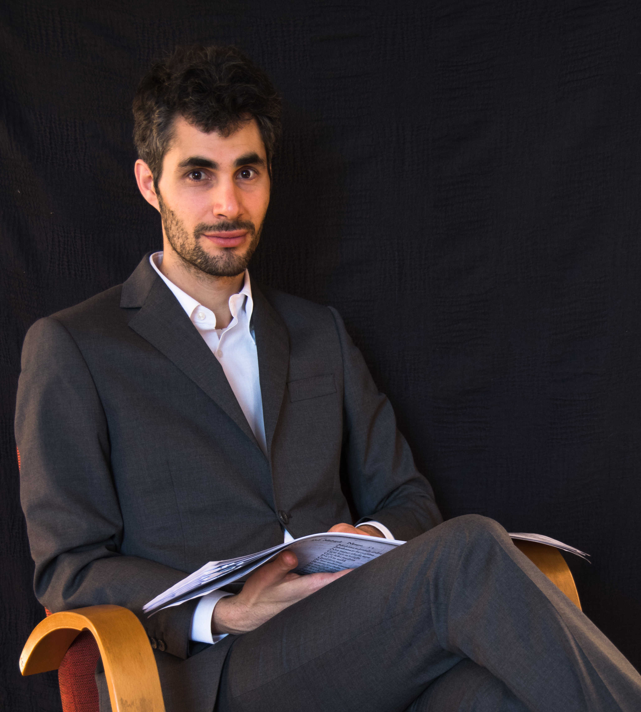

# Ensemble

## Le Vecchie Musiche: a new way of reading our cultural heritage

{align=left width="300" height ="300"} Should we consider history as a hard rock mountain, where the names of our famous ancestors are engraved on solid marble? Or is history a river, where the names are written on fragile parchment, floating around in small bowls? Noble swans swim round, select names and take them to a temple built on a small island. In analogy to the swans, we also save the names we consider important from oblivion and in so doing construct our cultural history and identity.[^1]

-   __MISSION__

    ---

    To give a new voice to those forgotten by history, is the mission of the ensemble _Le Vecchie Musiche, e la nuova maniera di leggerle_. It proposes a _new way of reading_ our cultural heritage, too often dominated by a rigid aesthetic canon.

-   __NAME__

    ---

    The name of the ensemble is a parody (a paraphrase in musical terms) of the famous collection of Giulio Caccini: _Le Nuove Musiche_, published in 1602. The monodies of Caccini contributed to the establishment of solo singing with instrumental accompaniment, thanks to the rapid spreading of music print editions. In an analogous way the development of digital technologies of the last decades has given us the possibility to share, research and find original sources worldwide.

- __PROJECTS__
    
    ---

    The projects within Le Vecchie Musiche are the result of the study of the life and works of musicians, supported by recent musicological research.

    These discoveries are presented to the listener through the life and music of artists from the past, opening up possibilities for interpretation and connection with our contemporary society.

- __HISTORY & FUTURE__
    
    ---
    
    The first experiment of the ensemble took place during October 2018, with the performance of the oratorium Santa Editta by composer Alessandro Stradella (1639-1682). The project, conceived by the artistic director Nicholas Cornia, resulted in the cooperation of a collective of students at the Ghent Conservatory. Since then every other project has been unique and collectively built. Through the intermingling of story and music of forgotten artists, the public takes a peek into the social and cultural context of past times and lives. Le Vecchie musiche aims to valorise artists excluded by our aesthetic canon. Through original concert programs, workshops, music transcriptions and research articles it offers new insights to our conception of the past.

[^1]: Reference to the voyage of Astolfo to the moon in Ariosto’s _Orlando Furioso_, Canto XXXV.
