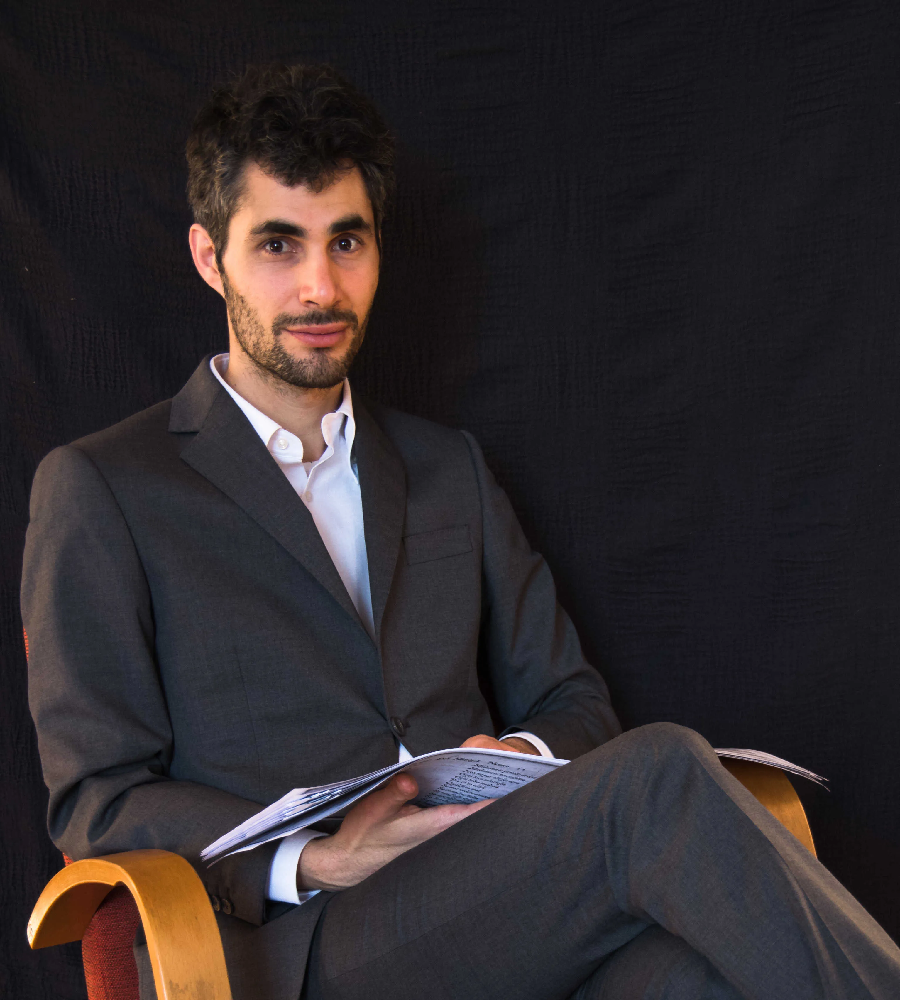

---
hide:
  - title
  - navigation
---

# Ensemble

## Le Vecchie Musiche: a new way of reading our cultural heritage

{align=left width="300" height ="300"} Dovremmo considerare la storia come un’ immanente montagna di dura roccia, e nell’ immutabile granito incisi i nomi degli illustri artisti? O è forse la storia come un fiume, nel quale i nomi dei nostri antenati viaggiano precari su fragili fogli in piccole ciotole trascinate dalla corrente? Alle volte alcuni nobili cigni selezionano pochi nomi fortunati e li depositano in un tempio, costruito su una piccola isola.  Proprio come questi cigni, costruiamo insieme la nostra identità culturale salvando dall’oblio del tempo i nomi delle personalità del passato che riteniamo significative. [^1]

-   __MISSIONE__

    ---

    Dare di nuovo voce a coloro che la storia ha dimenticato è la missione dell’ensemble musicale Le Vecchie Musiche, dove viene proposta una nuova maniera di leggere il nostro patrimonio culturale, troppo spesso dominato da un rigido canone estetico.

-   __NOME__

    ---

    Il nome dell’ensemble è una parodia (parafrasi in senso musicale) della famosa collezione di Giulio Caccini: Le Nuove Musiche, pubblicata nel 1602. Le monodie di Caccini contribuirono a divulgare e rafforzare la pratica musicale del canto solistico diminuito con accompagnamento strumentale, grazie alle edizioni a stampa. In modo analogo le tecnologie digitali degli ultimi decenni hanno permesso di poter condividere documenti originali e articoli di ricerca attraverso banche dati accessibili in tutto il mondo. 

- __PROGETTI__
    
    ---

    I vari progetti delle Vecchie Musiche sono il risultato di un’attenta ricerca della vita di musicisti e le loro composizioni, avvalendosi del supporto di recenti studi musicologici. Queste scoperte vengono presentate all’ascoltatore attraverso la storia di artisti e la loro musica, lasciando spazio per interpretazione e legami con la società attuale.

- __STORIA & AVVENIRE__
    
    ---
    
    L’ensemble prende forma già nell’ottobre del 2018 con la rappresentazione dell’oratorio Santa Editta del compositore Alessandro Stradella (1639-1682). Il progetto, concepito dal direttore artistico Nicholas Cornia, è stato il risultato della collaborazione tra studenti del Conservatorio di Gand. Fin dalla sua concezione, i membri dell’ensemble cooperano collettivamente alla creazione di concerti unici, che immergono il pubblico nel contesto socio-culturale dell’epoca attraverso i suoni e le storie di artisti spesso ignorati dal canone musicale odierno.

    Le Vecchie Musiche si impegnano per la valorizzazione di artisti esclusi dall’odierno canone musicale attraverso una programmazione di concerti inediti dediti a decontestualizzare l’attuale concezione del nostro passato. 

    L’ensemble si dedica alla divulgazione di conoscenza, attraverso workshops e la pubblicazione di trascrizioni e articoli di ricerca.

[^1]: Il viaggio di Astolfo sulla luna, tratto dall’ Orlando Furioso, canto XXXV, L. Ariosto.
