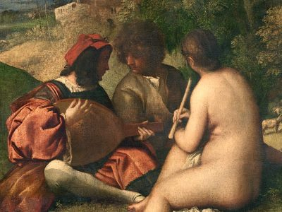
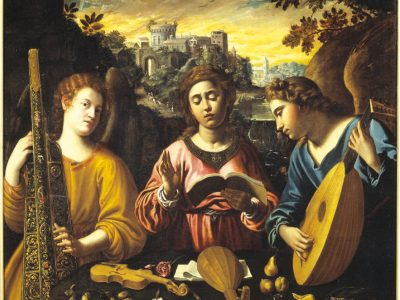

---
hide:
  - title
  - navigation
---

# Progetti

---

## [Missa Romantica](./projects/missa_romantica.md)

  {align=left width="300" height="300"} Siete curiosi di conoscere l'interpretazione della musica di Palestrina da parte di Richard Wagner?
  Allora partecipate al nostro workshop di due giorni in collaborazione con il direttore d'orchestra Florian Heyerick, dove canteremo alcune opere corali rinascimentali a partire dalle edizioni del XIX e dell'inizio del XX secolo, riflettendo lo spirito del cosiddetto “movimento Ceciliano”. [_Continua_](./projects/missa_romantica.md) 

## [Oddities & Rarities 2024](./projects/oddities_and_rarities_2024.md)

  {align=left width="300" height="300"} A cavallo tra i secoli XIX e XX l'arte Europa prese una vena orientalista ed esotica che ha generato un ampio corpus culturale, e soprattutto musicale. Tuttavia, oggi questo repertorio è avvolto da una forte critica a cui sono associati imperialismo, colonialismo e appropriazione culturale. Il progetto vuole proporre un modo per affrontarlo come musicisti e come pubblico. [_Continua_](./projects/oddities_and_rarities_2024.md) 

 

## [Sprezzanti Rime](./projects/sprezzanti_rime.md)

{align=left width="300" height="300"} Il tema della femminilità, tanto caro al nostro ensemble, svolge ancora una volta un ruolo principe: le vicissitudini di poetesse dell’Italia del Cinquecento sono raccontate attraverso i loro sonetti, ottave e terze rime, poste in musica da artisti coevi en non. [_Continua_](./projects/sprezzanti_rime.md) 

## [Sketches of Arcadia](./projects/sketches_of_arcadia.md)

{align=left width="300" height="300"} La Londra del primo Settecento è da considerarsi the place to be per molti artisti in cerca di ricchi impresari e mecenati. L’Inghilterra del tempo cominciava già a ricoprire il ruolo di grande potenza nella politica europea e globale, grazie alla sua flotta e una crescente influenza coloniale ed industriale... [_Continua_](./projects/sketches_of_arcadia.md)

## [La Predica del Sole](./projects/predica_del_sole.md)

{align=left width="300" height="300"} Il conflitto di Galilei con la Chiesa cattolica romana, che nel 1633 gli impose di rinnegare la sua fede nell'eliocentrismo e lo mise agli arresti domiciliari, è diventato un archetipo popolare del rapporto storico conflittuale tra scienza e fede. [_Continua_](./projects/predica_del_sole.md)

## [Discanting the Classics](./projects/discanting_the_classics.md)

{align=left width="300" height="300"} Vorremmo portarvi nella mente degli uomini del XVI secolo e nel loro rapporto con i classici romani e greci. Come interpretavano questi testi classici, questa musica antica e perduta? [_Continua_](./projects/discanting_the_classics.md)

## [Madrigali Ariosi](./projects/madrigali_ariosi.md)

{align=left width="300" height="300"} Uno degli anelli mancanti dell’evoluzione stilistica del Cinquecento è il cosiddetto madrigale arioso. Il nome stesso suggerisce un paradosso: come può un madrigale, ossia una rappresentazione musicale di poesia profana in stile polifonico, avere le proprietà di un’aria, associata al canto solistico? Nel nostro programma concertistico dei Madrigali Ariosi vogliamo accompagnarvi nelle vicende amorose dei personaggi dell’Orlando Furioso, narrate dal punto di vista di questo curioso genere musicale. [_Continua_](./projects/madrigali_ariosi.md)

## [Caffè Cantata](./projects/caffe_cantata.md)

{align=left width="300" height="300"} Contrariamente al successo pervenuto dal Madrigale e l’Opera, nel revival musicale iniziato lo scorso secolo, la Cantata resta ancora oggi la pecora nera della musica antica. Il progetto Caffè Cantata si propone di avvicinare l’ascoltatore a questo genere singolare attraverso una serie di brevi concerti, mostrandone lo spirito di adattamento a diverse culture e contesti sociali. [_Continua_](./projects/caffe_cantata.md)

## [Heliopolis](./projects/heliopolis.md)

{align=left width="300" height="300"} Heliopolis, la città del sole, è un luogo dove gli strali dell’Arte illuminano la nostra società, proteggendola dalle ombre della paura e dell’oppressione. Lasciatevi accompagnare dal nostro programma musicale nella gioventù di Franz Schubert e i suoi più intimi amici. Un percorso attraverso la loro lotta per Onore, Libertà e Patria. [_Continua_](./projects/heliopolis.md)

## [Le Donne Antique](./projects/donne_antique.md)

{align=left width="300" height="300"} Con il nostro concerto Le Donne Antique vogliamo presentare il ricco panorama musicale della prima metà del XVI secolo a Ferrara, affiancando la musica profana della corte con quella dei conventi. Attraverso l’ipotetica corrispondenza tra Leonora d’Este e la sua nipote Anna vogliamo esplorare il paradosso …  [_Continua_](./projects/donne_antique.md)

## [L'Amorosa Filosofia](./projects/amorosa_filosofia.md)

{align=left width="300" height="300"} Attraverso la storia di Tarquinia Molza (1542-1617), forse la più importante artista della sua generazione, vogliamo esplorare il florido panorama artistico femminile attivo nelle corti del nord Italia durante la seconda metà del Cinquecento …   [_Continua_](./projects/amorosa_filosofia.md)

## [Santa Editta](./projects/santa_editta.md)

{align=left width="300" height="300"} L’eccentrica figura del compositore italiano Alessandro Stradella (1639-1682), assassinata a Genova in circostanze misteriose, ha ispirato generazioni di musicisti e scrittori …  [_Continua_](./projects/santa_editta.md)

