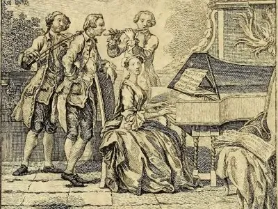

---
hide:
  - title
  - navigation
---

# Caffè Cantata

{align =left}

Contrariamente al successo pervenuto dal Madrigale e l’Opera, nel revival musicale iniziato lo scorso secolo, la Cantata resta ancora oggi la pecora nera della musica antica. Essa combina lo stile polifonico e la monodia affiancandoli con il potere drammatico della rappresentazione teatrale. Questa fusione di generi rese la Cantata un incredibile laboratorio di sperimentazione per i compositori del Seicento e Settecento europeo. E proprio la sua natura multiforme l’ha resa difficile da comprendere per il pubblico e gli esecutori moderni.

Il progetto Caffè Cantata si propone di avvicinare l’ascoltatore a questo genere singolare atflauto traversiere una serie di brevi concerti, mostrandone lo spirito di adattamento a diverse culture e contesti sociali.

### The Dark Side of the Sun: Antonia Bembo alla corte di Luigi XIV

L’affascinante vita della musicista veneziana Antonia Bembo (c. 1640-1720) è ancora offuscata da troppe ombre. Siamo però certi del suo contributo artistico nell’avvicinare la tradizione musicale italiana a quella francese: les goûts réunis, citando François Couperin. Questo concerto vuole mettere in luce il rapporto di Antonia con il panorama artistico parigino alla corte del Re Sole.

### [Sketches of Arcadia](sketches_of_arcadia.md): Stile italiano nella Londra del Settecento

La Londra del primo Settecento è da considerarsi the place to be per molti artisti in cerca di ricchi impresari e mecenati. L’Inghilterra del tempo cominciava già a ricoprire il ruolo di grande potenza nella politica europea e globale, grazie alla sua flotta e una crescente influenza coloniale ed industriale.

Le possibilità economiche della nuova classe borghese crearono un interessante mercato di svaghi per occupare  il tempo libero dei nuovi ricchi: una densa stagione teatrale, romanzi, poesie e in particolar modo musica d’intrattenimento. Molti musicisti italiani del tempo, come i compositori Giovanni Bononcini, Nicola Porpora ed Attilio Ariosti, cercarono fama e fortuna nell’esuberante metropoli nord europea, un destino ancora condiviso da molti expats del Bel Paese.

## Musicisti

- Patrick Beukels, flauto traversiere
- Nicholas Cornia, direttore artistico
- Florian Heyerick, clavicembalo
- Dirk Moelants, viola da gamba
- Jana Pieters, soprano
- Arina Tsytlenok, flauto traversiere
- Lidwien Van Winckel, soprano
- Veera Voordeckers, clavicembalo

## Media

<iframe width="560" height="315" src="https://www.youtube.com/embed/videoseries?si=FxBabSQKdLH_0WUM&amp;list=PLDTXvtcLnrvHlwguKgqVOmX6XpxSJc_6G" title="YouTube video player" frameborder="0" allow="accelerometer; autoplay; clipboard-write; encrypted-media; gyroscope; picture-in-picture; web-share" referrerpolicy="strict-origin-when-cross-origin" allowfullscreen></iframe>

