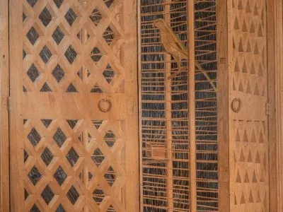

---
hide:
  - title
  - navigation
---

# Le Donne Antique

{align =left}

```
Ecco amore mio, mia colomba, mia bella, 
Ecco, egli viene saltando sui monti, balzando sui colli. 
Egli giunge saltellando tra le montagne e colline! 
Il mio diletto è simile a una gazzella o ad un cerbiatto. 
Eccolo, egli sta dietro al nostro muro, guarda dalle finestre, lancia occhiate attraverso l’inferriata. 
Il mio diletto mi ha parlato e mi ha detto: 
“Alzati, amica mia, mia bella, e vieni! 
Poiché, ecco, l’inverno è passato, la pioggia è cessata, se n’è andata. Vieni, mia colomba.”

(Copyright © 1991 by La Buona Novella s.c.r.l.)
```

Se l’aquila è il simbolo degli uomini della famiglia nobiliare d’Este di Ferrara allora possiamo associare la candida colomba della presente citazione come metafora per il ceppo femminile del casato estense. Il testo latino Ecce amica mea, proveniente dal Cantico dei Cantici di Re Salomone, è stato utilizzato nel motetto di Maistre Jhan come encomio a Suor Leonora.

La badessa, compositrice e nobile Leonora d’Este (1515-1575) intraprese la vita monastica in tenera età, contro il volere di suo padre il duca Alfonso I. All’età di soli 8 anni Leonora entra nel monastero del Corpus Domini di Ferrara, dove passerà il resto dei suoi giorni. Una caratteristica delle sue opere sono le composizioni vocali a voci pari, ideali per cori composti di sole monache.

Un altro personaggio attivo a Ferrara nel primo Cinquecento è il poeta Ludovico Ariosto. Il suo capolavoro Orlando Furioso fu scritto per la corte estense. 

Con il nostro concerto Le Donne Antique vogliamo presentare il ricco panorama musicale della prima metà del XVI secolo a Ferrara, affiancando la musica profana della corte con quella dei conventi. Attraverso l’ipotetica corrispondenza tra Suor Leonora e la sua nipote Anna d’Este (1531-1607) vogliamo esplorare il paradosso fra l’isolamento fisico e la libertà artistica e spirituale goduto dalle donne appartenenti ad ordini religiosi durante il Rinascimento. 

## Musicisti

- Michel Blockx, trombone e bombarda
- Nicholas Cornia, voce e cornetto
- Mieke Dhondt, voce
- Laura Gekiere, voce
- Marleen Leicher, cornetto e flauto dolce
- Catou Pecher, trombone alto
- Goedele Reyniers, voce
- Mirella Ruigrok, flauto dolce e dulciana
- Nikita Semionova, voce
- Rein Van Bree, voce e flauto dolce
- Leo Van Cleynenbreugel, voce
- Lidwien Van Winckel, voce
- Els Wollaert, voce

## Media

<iframe width="560" height="315" src="https://www.youtube.com/embed/videoseries?si=oAA_htAKvMaM2qSI&amp;list=PLDTXvtcLnrvEhnxMZmcv7Nd-Gdt1veW0J" title="YouTube video player" frameborder="0" allow="accelerometer; autoplay; clipboard-write; encrypted-media; gyroscope; picture-in-picture; web-share" referrerpolicy="strict-origin-when-cross-origin" allowfullscreen></iframe>

