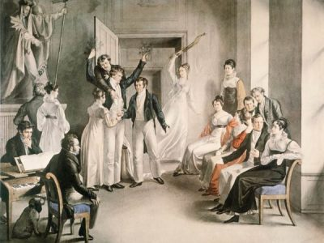

---
hide:
  - title
  - navigation
---

# Heliopolis

{align =left}

```
[…] der Dichter lebt vom Seyn.
Athme du den heil’gen Aether,
Schling’ die Arme um die Welt;
Nur dem Würdigen, dem Großen
Bleibe muthig zugesellt.
Laß die Leidenschaften sausen
Im metallenen Accord;
Wenn die starken Stürme brausen,
Findest du das rechte Wort.

(J. Mayrhofer, Heliopolis n. 12, 1821)
```

```
[…] de dichter leeft van ’t Zijn.
Adem ín de heil’ge ether,
En omarm de wereld wijd,
Slechts het waardige, het grote,
Blijf dat moedig toegewijd.
Laat de hartstochten maar dreunen
In metalen galmakkoord,
Als de sterke stormen kreunen,
Vind jij juist het goede woord.

(J. Mayrhofer, Heliopolis n. 12, 1821)
copyright © 2007 by Lau Kanen
```

Questo frammento poetico è un esempio lampante dell’ideale Romantico: l’artista è sopraffatto dalla sublime bellezza della Natura. Ma è l’insignificante dettaglio Im metallenen Accord che coglie la nostra attenzione. A cosa potrebbe riferirsi? Forse un elogio al compagno più inaspettato dell’anima Romantica: la chitarra?

Grazie alle migliorie apportate allo strumento nei primi anni dell’Ottocento, la sua popolarità è aumentata considerevolmente. Recenti studi hanno mostrato come questo strumento musicale abbia ispirato l’opera di compositori come il giovane Franz Schubert.
Nel corso dei primi anni della sua carriera non avrebbe posseduto un pianoforte per comporre e molti dei suoi compagni avrebbero suonato la chitarra.

La Vienna del Biedermeier nel periodo immediatamente successivo alla Restaurazione era una città controllata da una delle censure politiche più oppressive della storia. Durante questi difficili anni d’ingiustizia, i vari artisti hanno comunque trovato modo di esprimersi: hanno cercato conforto nell’idilliaca e innocente vita bucolica, riparo in saloni privati e società segrete.

Heliopolis, la città del sole, è un luogo dove gli strali dell’Arte illuminano la nostra società, proteggendola dalle ombre della paura e dell’oppressione. Lasciatevi accompagnare dal nostro programma musicale nella gioventù di Franz Schubert e i suoi più intimi amici. Un percorso attraverso la loro lotta per Onore, Libertà e Patria.

## Musicisti

- Nicholas Cornia, direttore artistico e basso
- Igor Sirotinksy, chitarra romantica
- Mathis Van Cleynenbreugel, tenore
- Leander Van Gijsegem, tenore
- Lidwien Van Winckel, soprano
- Veera Voordeckers, pianoforte

## Media

<iframe width="560" height="315" src="https://www.youtube.com/embed/0_UJrzpt9nk?si=BSpO6RnIkzRJVIH4" title="YouTube video player" frameborder="0" allow="accelerometer; autoplay; clipboard-write; encrypted-media; gyroscope; picture-in-picture; web-share" referrerpolicy="strict-origin-when-cross-origin" allowfullscreen></iframe>

