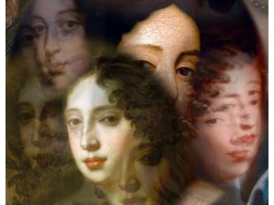

---
hide:
  - title
  - navigation
---

# Santa Editta

{align =left}

L’eccentrica figura del compositore italiano Alessandro Stradella (1639-1682), assassinata a Genova in circostanze misteriose, ha ispirato generazioni di musicisti e scrittori. Soltanto grazie alla recente ricerca musicologica di Carolyn Gianturco possiamo finalmente far luce sulla vita del compositore di Nepi, per troppo tempo oscurata da leggende spesso infondate.

Il 4 Ottobre 2018 abbiamo presentato l’oratorio Santa Editta, Vergine e Monaca, Regina d’Inghilterra nella chiesa di Santa Elisabetta a Gand. Molto probabilmente questo oratorio è stato scritto per il matrimonio di Giacomo Stuart d’Inghilterra e la giovane Maria Beatrice d’Este e nel 1673 su commissione di sua madre Laura Martinozzi e il cardinale Lelio Orsini, autore del libretto.

Rappresentare la storia della poco conosciuta Santa Editta di Wilton è decisamente inusuale: la scelta della santa è riconducibile al desiderio della giovane Maria Beatrice di prendere i voti monastici piuttosto che il matrimonio con il futuro re d’Inghilterra. Un simile dilemma si presentò anche ad Editta di Wilton nel X secolo.

Il testo del libretto presenta un messaggio di critica politica, spesso utilizzato in Italia  per sfuggire alla censura durante il XVII secolo.   

## Musicisti

- Nicholas Cornia, direttore artistico e Senso
- Thomas Langlois, luito barocco
- Dirk Moelants, viola da gamba
- Jana Pieters, Editta
- Arina Tsytlenok, clavicembalo
- Leander Van Gijsegem, Bellezza
- Lidwien Van Winckel, Umiltà e Nobiltà
- Ellen Wills, regia e Grandezza

## Media

<iframe width="560" height="315" src="https://www.youtube.com/embed/videoseries?si=Eu3kedTefTSsdvkK&amp;list=PLDTXvtcLnrvG4Qvd07zfQN0Sc0AtC5LhI" title="YouTube video player" frameborder="0" allow="accelerometer; autoplay; clipboard-write; encrypted-media; gyroscope; picture-in-picture; web-share" referrerpolicy="strict-origin-when-cross-origin" allowfullscreen></iframe>

