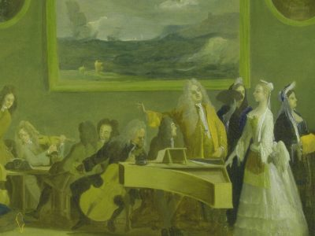

---
hide:
  - title
  - navigation
---

# Sketches of Arcadia

{align =left}

La Londra del primo Settecento è da considerarsi the place to be per molti artisti in cerca di ricchi impresari e mecenati. L’Inghilterra del tempo cominciava già a ricoprire il ruolo di grande potenza nella politica europea e globale, grazie alla sua flotta e una crescente influenza coloniale ed industriale.

Le possibilità economiche della nuova classe borghese crearono un interessante mercato di svaghi per occupare  il tempo libero dei nuovi ricchi: una densa stagione teatrale, romanzi, poesie e in particolar modo musica d’intrattenimento. Molti musicisti italiani del tempo, come i compositori Giovanni Bononcini, Nicola Porpora ed Attilio Ariosti, cercarono fama e fortuna nell’esuberante metropoli nord europea, un destino ancora condiviso da molti expats del Bel Paese.

Non solo compositori, ma anche virtuosi del canto come Margherita de L’Épine, immortalata nel quadro di Marco Ricci Rehearsal of an opera nell’immagine di copertina del progetto, erano al centro della stagione londinese di eventi mondani e pettegolezzi. Illustri musici, strumentisti e cantanti virtuosi stranieri dominavano la scena londinese, portando con sé parte della loro cultura ed arte, spesso in contrasto con l’ideologia ed estetica britannica. Molti documenti d’archivio mostrano come l’eccessivo manierismo italiano era soggetto a dure critiche, considerato troppo stravagante ed eccessivo.

Questo scontro culturale era fortunatamente mitigato dal comune patrimonio della mitologia e letteratura classica del mondo greco e latino, in particolar modo il pantheon arcadico di pastori, ninfe, satiri e divinità pagane. Questa mania pastorale, originatasi già nel Cinquecento, ha affascinato tutta Europa fino al tardo Ottocento, incluse le isole britanniche. Le vicende amorose di un paese idilliaco, dove la natura e la vita semplice regnano indiscusse, era alla base di un modo fantastico condiviso da tutti, trovando intersezioni nel folklore scozzese ed insulare, preannunciando la cultura romantica dei decenni avvenire.

Una specie di nefasta profezia che anticiperà il desiderio dell’uomo comune di tornare alle origini, annichilito dal progresso scientifico e tecnologico dell’Illuminismo. Strumento principe, praticato nei vari gentlemen’s clubs britannici, è il flauto, in particolar modo quello traversiere. Questo strumento a fiato fa riecheggiare il suono mistico del flauto di pan, praticato dai pastori e satiri dell’Arcadia. La sua popolarità può essere dedotta dalle molte trascrizioni per lo strumento di arie e canzoni famose, presenti in varie collezioni musicali e riviste coeve. 

Sketches of Arcadia ci fa rivivere la magia di queste cantate e canzoni del primo Settecento, accomunate dal fantastico mondo della letteratura dell’Arcadia. L’attraente e controverso “stile italiano” (Italian manner) ha ispirato generazioni di scrittori e compositori inglesi, collaborando con artisti provenienti dall’Europa continentale.

## Musicisti

- Patrick Beukels, flauto traversiere
- Florian Heyerick, clavicembalo
- Dirk Moelants, viola da gamba
- Jana Pieters, soprano
- Arina Tsytlenok, flauto traversiere

## Media

<iframe width="560" height="315" src="https://www.youtube.com/embed/videoseries?si=EK7TUQT3wwqoYK_g&amp;list=PLDTXvtcLnrvEIwoM-GZGH0jvztRFmg7cF" title="YouTube video player" frameborder="0" allow="accelerometer; autoplay; clipboard-write; encrypted-media; gyroscope; picture-in-picture; web-share" referrerpolicy="strict-origin-when-cross-origin" allowfullscreen></iframe>

