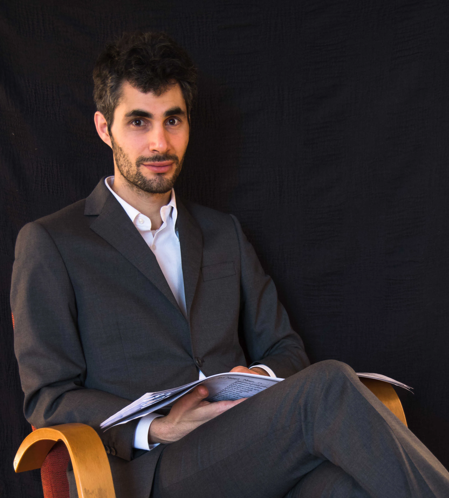

---
hide:
  - title
  - navigation
---

# Ensemble

## Le Vecchie Musiche: een nieuwe manier om ons cultureel erfgoed te lezen.

{align=left width="300" height ="300"} Is geschiedenis als een berg: imposant, onveranderlijk en van harde steen, waar de namen van onze illustere voorgangers gebeiteld staan in graniet? Of is geschiedenis een rivier waarop namen op fragiele blaadjes in kommetjes dobberen? Zwanen halen sommige uit het water en geven ze een plek in een tempel op een eiland. Net zoals de zwanen redden wij de namen die we belangrijk achten uit de stroom der vergetelheid en construeren hiermee onze culturele geschiedenis en identiteit.[^1]

-   __MISSIE__

    ---

    Opnieuw een stem geven aan wie door de geschiedenis vergeten werd, is de missie van het ensemble *Le Vecchie Musiche*, e la nuova maniera di leggerle.

    Door een *nieuwe manier* om ons cultureel erfgoed te *lezen*, trachten de leden een tegenwicht te bieden aan een strikte esthetische canon.

-   __NAAM__

    ---

    De naam van het ensemble is een parodie (een parafrase in muzikale termen) op de beroemde collectie van Giulio Caccini: *Le Nuove Musiche* (1602). De monodieën van Caccini droegen bij aan de verspreiding en versterking van die muzikale praktijk van een solostem met instrumentale begeleiding. Dat succes was onmogelijk geweest zonder de snelle ontwikkelingen in het drukwerk. Op een gelijkaardige manier bieden de recente ontwikkelingen in digitale technologieën ons de mogelijkheid om manuscripten en originele bronnen te delen, te zoeken en te vinden in databanken wereldwijd.

- __PROJECTEN__
    
    ---

    De diverse projecten van *Le Vecchie Musiche* zijn het resultaat van een zorgvuldige studie naar de levens en het werk van musici, geïnspireerd door recent musicologisch onderzoek. De ontdekkingen worden aan het publiek gepresenteerd met gepaste aandacht voor de levensverhalen en de muziek van musici uit het verleden. Er wordt ruimte gecreëerd voor eigen interpretatie en linken met de huidige samenleving.

- __GESCHIEDENIS & TOEKOMST__
    
    ---
    
    De kiem voor het ensemble ontstond in oktober 2018 bij de uitvoering van het oratorium *Santa Editta* van de Italiaanse componist Alessandro Stradella (1639-1682). Het project, ontsproten aan het hoofd van artistiek leider Nicholas Cornia, was het resultaat van een samenwerking tussen studenten van het Koninklijk Conservatorium in Gent. Sindsdien werken de leden collectief samen aan unieke concerten. Dankzij een combinatie van woord en muziek, krijgt het publiek een kijk op de socio-culturele context waarin de te lang vergeten artiesten leefden en werkten.

    *Le Vecchie Musiche* zet zich in om artiesten te herwaarderen die buiten de hedendaagse canon vallen. Door originele concertprogramma’s tracht het ensemble onze huidige visie op het verleden te decontextualiseren. Daarnaast wil het ensemble kennis verspreiden via workshops en de publicatie van transcripties en onderzoeksartikels.

[^1]: Referentie aan Astolfo op de maan uit Ariosto’s _Orlando Furioso_, Canto XXXV.
