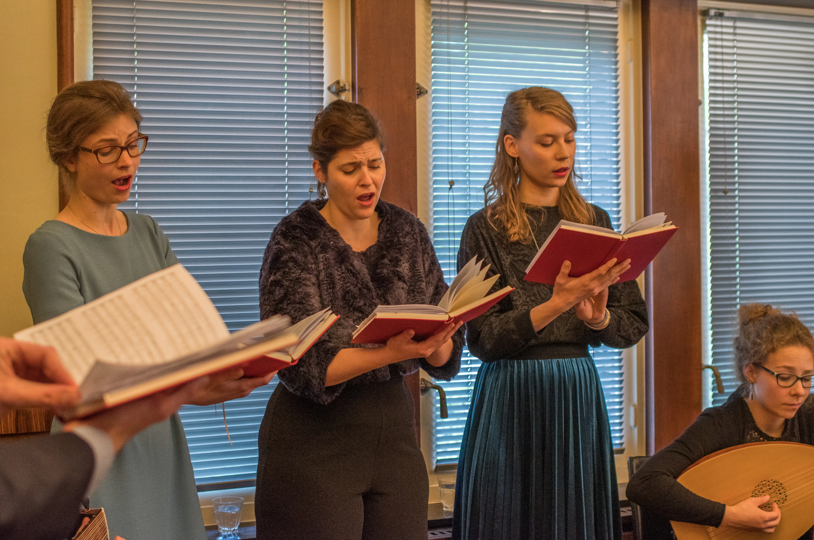
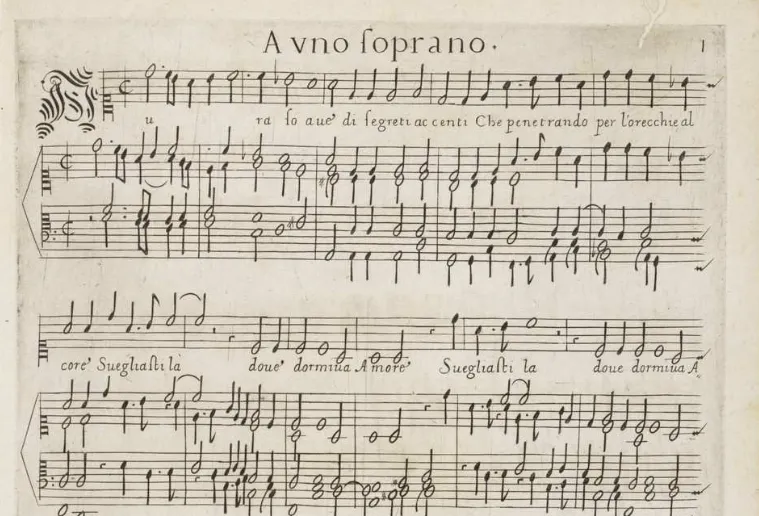

---
hide:
  - title
  - navigation
  - toc
---

# 

{width ="600" height="300"}

<!-- -->

- [Projecten](projects.md){ .md-button }
  { width = "300" height = "300"}
- [Digitaal Archief](archive.md){.md-button}
  {width = "300" height = "300"}

