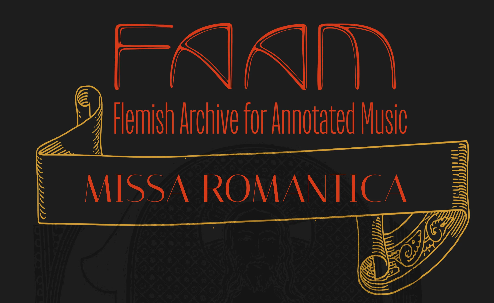
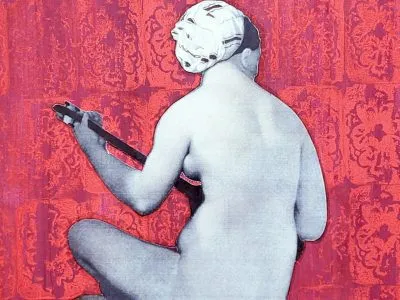
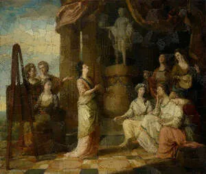
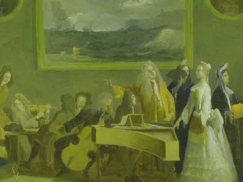
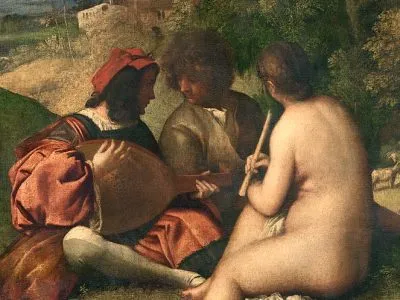
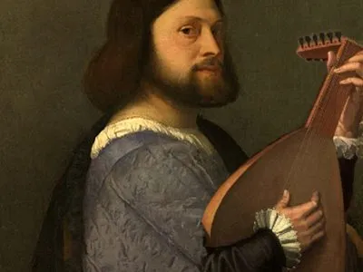
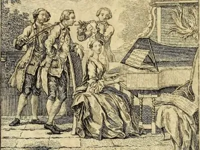
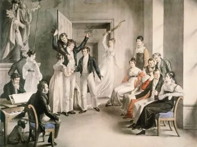
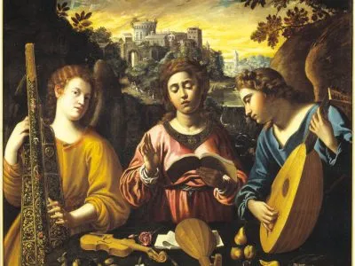
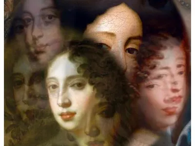

---
hide:
  - title
  - navigation
---

# Projecten

---

## [Oddities & Rarities 2025](./projects/oddities_and_rarities_2025.md)

  {align=left width="300" height="300"} Oddities & Rarities doorbreekt de grenzen tussen kunstvormen, historische periodes, realiteit en fictie. Door de ogen van de negentiende-eeuwse romantici vertalen we hun fascinatie voor het sublieme en het onverklaarbare in klank, woord, beeld, licht, en zelfs het bovenaardse. [_Lees verder_](./projects/oddities_and_rarities_2025.md) 

 

## [Missa Romantica](./projects/missa_romantica.md)

  {align=left width="300" height="300"} Ben jij benieuwd naar de interpretatie van Richard Wagner van Palestrina’s muziek?
  Neem dan deel aan onze tweedaagse workshop in samenwerking met dirigent Florian Heyerick, waar we enkele koorwerken uit de renaissance zullen zingen volgens edities uit de 19de en vroege 20ste eeuw, die de geest van de zogenoemde “Sint-Cecilia beweging” weerspiegelen. [_Lees verder_](./projects/missa_romantica.md) 

 

## [Oddities & Rarities 2024](./projects/oddities_and_rarities_2024.md)

  {align=left width="300" height="300"} West-Europa kende in de late negentiende en vroege twintigste eeuw een trend van oriëntalistische en exotische kunst, die een groot cultureel, en in het bijzonder muzikaal, oeuvre heeft gegenereerd. Dergelijke werken baden vandaag echter in bedenkelijke wateren, waarmee imperialisme, kolonialisme en culturele toe-eigening worden geassocieerd. Hoe gaan we daar als muzikanten en als publiek mee om? [_Lees verder_](./projects/oddities_and_rarities_2024.md) 

 

## [Sprezzanti Rime](./projects/sprezzanti_rime.md)

{align=left width="300" height="300"} Het thema van vrouwelijkheid, dat ons ensemble zo na aan het hart ligt, speelt opnieuw een centraal rol: de lotgevallen van vrouwelijke dichters uit het Italië van de 16e eeuw worden verteld aan de hand van hun sonnetten, octaven en tertsrijmen, op muziek gezet door hedendaagse kunstenaars. [_Lees verder_](./projects/sprezzanti_rime.md) 

## [Sketches of Arcadia](./projects/sketches_of_arcadia.md)

{align=left width="300" height="300"} 1Londen in de 18de eeuw was the place to be voor artiesten en performers op zoek naar rijke werkgevers en mecenassen. Dankzij een bloeiende economie, groeiende industrie, nieuwe inkomsten uit kolonies en een oppermachtige marine groeide Engeland uit tot een welvarende mogendheid binnen Europa en de rest van de wereld. De nieuwe Britse middenklasse profiteerde en kon zich nieuwe vormen van ontspanning permitteren, waarop een interessante entertainmentsector ontstond met theater, literatuur en muziek. [_Lees verder_](./projects/sketches_of_arcadia.md)

## [La Predica del Sole](./projects/predica_del_sole.md)

{align=left width="300" height="300"} Galilei’s conflict met de rooms-katholieke kerk, waarbij hij in 1633 zijn geloof in het heliocentrisme moest ontkennen en onder huisarrest werd geplaatst, is een populair archetype geworden voor de historische relatie, lees: onverenigbaarheid, tussen wetenschap en geloof. [_Lees verder_](./projects/predica_del_sole.md)

## [Discanting the Classics](./projects/discanting_the_classics.md)

{align=left width="300" height="300"} We willen u graag meenemen naar de 16e eeuwers en hun relatie tot de Romeinse en Griekse klassieken. Hoe interpreteren ze deze klassieke teksten, deze oude, verloren muziek? [_Lees verder_](./projects/discanting_the_classics.md)

## [Madrigali Ariosi](./projects/madrigali_ariosi.md)

{align=left width="300" height="300"} Eén van de missing links in de stijlevolutie van de 16de eeuw is het zogenoemde arioso madrigaal. De naam zelf bevat een paradox: hoe kan een madrigaal, zijnde een muzikale voorstelling van profane poëzie in polyfone stijl, de kenmerken bezitten van een aria, immer geassocieerd met solozang? In ons concertprogramma Madrigali Ariosi leiden we u doorheen de amoureuze avonturen van de personages uit de Orlando Furioso via dit interessante muzikale genre. [_Lees verder_](./projects/madrigali_ariosi.md)

## [Caffè Cantata](./projects/caffe_cantata.md)

{align=left width="300" height="300"} In tegenstelling tot het succes dat madrigaal en opera sinds de revival  van vorige eeuw genieten, blijft de cantate het zwarte schaap van de oude muziek. Het project Caffè Cantata streeft ernaar de luisteraar dichtbij dit unieke genre te brengen door een reeks korte concerten, waar de cantate in verschillende socio-culturele contexten wordt getoond. [_Lees verder_](./projects/caffe_cantata.md)

## [Heliopolis](./projects/heliopolis.md)

{align=left width="300" height="300"} Heliopolis, de stad van de zon, is een plek waar Kunst de maatschappij verlicht tegen de duisternis van angst en onderdrukking. Doorheen ons programma nemen we jullie mee in het jonge leven van Franz Schubert en zijn vrienden in hun strijd voor Eer, Vrijheid en Vaderland.   [_Lees verder_](./projects/heliopolis.md)

## [Le Donne Antique](./projects/donne_antique.md)

{align=left width="300" height="300"} Met het concertprogramma Le Donne Antique brengen we muziek uit het Ferrara van de eerste helft van de 16de eeuw. We plaatsen de muziek aan het hof naast de muziek in het klooster. Door een fictieve briefcorrespondentie tussen Leonora d’Este en haar nicht Anna onderzoeken we de paradox...  [_Lees verder_](./projects/donne_antique.md)

## [L'Amorosa Filosofia](./projects/amorosa_filosofia.md)

{align=left width="300" height="300"} Via het levensverhaal van Tarquinia Molza, misschien wel de belangrijkste muzikante van haar generatie, belichten we het rijke netwerk van muzikantes, actief in verschillende hoven en steden van Noord-Italië in de tweede helft van de 16de eeuw...  [_Lees verder_](./projects/amorosa_filosofia.md)

## [Santa Editta](./projects/santa_editta.md)

{align=left width="300" height="300"} Via het levensverhaal van Tarquinia Molza, misschien wel de belangrijkste muzikante van haar generatie, belichten we het rijke netwerk van muzikantes, actief in verschillende hoven en steden van Noord-Italië in de tweede helft van de 16de eeuw...  [_Lees verder_](./projects/santa_editta.md)

