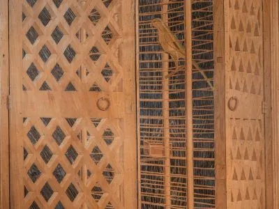

---
hide:
  - title
  - navigation
---

# Le Donne Antique

{align =left}

```
Ziet mijn vriendin, mijn duif, mijn schone, mooi meisje,
Hij komt, springende op de bergen,  huppelende op de heuvelen!
Mijn Liefste is gelijk een ree, of een welp der herten; 
Hij staat achter onzen muur, kijkende uit de vensteren, blinkende uit de traliën.
Mijn Liefste antwoordt, en zegt tot mij: 
Sta op, mijn vriendin, mijn schone, en kom! 
Want zie, de winter is voorbij, de plasregen is over, hij is overgegaan.
Mijn duifje kom.
```

Waar de adelaar het symbool was voor de mannelijke tak van de hertogelijke Este-familie, kunnen we de zuivere witte duif in bovenstaand citaat als metafoor zien voor de vrouwen. Dit fragment uit het Hooglied werd inderdaad op muziek gezet door Maistre Jhan, die het motet opdroeg aan Suor Leonora.

Die abdis, componiste én edelvrouw Leonora d’Este (1515-1575) had al op 8-jarige leeftijd beslist om, tegen de wil van haar vader, hertog Alfonso I van Ferrara, in te treden bij de Clarissen van het Corpus Domini-klooster. Kenmerkend voor haar muziek zijn *voci pari*-composities (vocale werken voor gelijke stemmen): ideaal voor een vrouwenensemble van nonnen.

Wie ook actief was in de eerste helft van de 16de eeuw in Ferrara, was de dichter Ludovico Ariosto. Hij schreef zijn meesterwerk Orlando Furioso (De Razende Roeland) specifiek voor het hof.

Met het concertprogramma *Le Donne Antique* (de vrouwen van het verleden) brengen we muziek uit het Ferrara van de eerste helft van de 16de eeuw. We plaatsen de muziek aan het hof naast de muziek in het klooster. Door een fictieve briefcorrespondentie tussen Leonora en haar nicht Anna d’Este (1531-1607)  onderzoeken we de paradox dat de nonnen weliswaar geen fysieke vrijheid kenden, maar wel genoten van een geestelijke en artistieke vrijheid.  

## Uitvoerders

- Michel Blockx, trombone en bombarde
- Nicholas Cornia, zang en cornetto
- Mieke Dhondt, zang
- Laura Gekiere, zang
- Marleen Leicher, cornetto en blokfluit
- Catou Pecher, alttrombone
- Goedele Reyniers, zang
- Mirella Ruigrok, blokfluit en dulciaan
- Nikita Semionova, zang
- Rein Van Bree, zang en blokfluit
- Leo Van Cleynenbreugel, zang
- Lidwien Van Winckel, zang
- Els Wollaert, zang

## Media

<iframe width="560" height="315" src="https://www.youtube.com/embed/videoseries?si=oAA_htAKvMaM2qSI&amp;list=PLDTXvtcLnrvEhnxMZmcv7Nd-Gdt1veW0J" title="YouTube video player" frameborder="0" allow="accelerometer; autoplay; clipboard-write; encrypted-media; gyroscope; picture-in-picture; web-share" referrerpolicy="strict-origin-when-cross-origin" allowfullscreen></iframe>

