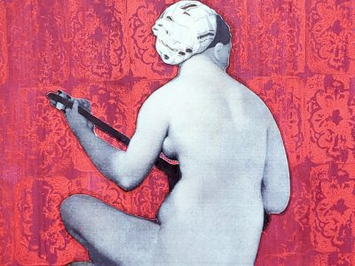

---
hide:
  - title
  - navigation
---

# Oddities & Rarities 2024

{align =left}

West-Europa kende in de late negentiende en vroege twintigste eeuw een trend van oriëntalistische en exotische kunst, die een groot cultureel, en in het bijzonder muzikaal, oeuvre heeft gegenereerd. Dergelijke werken baden vandaag echter in bedenkelijke wateren, waarmee imperialisme, kolonialisme en culturele toe-eigening worden geassocieerd. Hoe gaan we daar als muzikanten en als publiek mee om? 

Het nieuwe festival Oddities & Rarities wil fungeren als een platform dat ruimte schept om op een menselijke manier met die vraag om te gaan. 

Oddities & Rarities is een cross-over muziekfestival waar de ontmoeting tussen verschillende culturen centraal staat. Met dit festival werpen we een nieuwe blik op Westerse muziek geïnspireerd door het Oosten. Omdat dit repertoire vaak geassocieerd wordt met haar koloniale onstaansachtergrond, wordt ze vaak gemakshalve verborgen. Via ontmoeting en dialoog wil dit project voor dit ongemakkelijk stuk muzikaal erfgoed opnieuw een plaats zoeken in het huidige culturele landschap.

Het project omvat een creatieve concertreeks met 7 concerten, gespreid over 3 dagen, waarin klassieke en wereldmuzikanten samenwerken om unieke programma’s te creëren. Dankzij de medewerking van muzikanten met internationale achtergronden, bieden we een gelegenheid voor verwondering en appreciatie van elkaars cultureel erfgoed.

Daarnaast bieden we workshops, lezingen en een specialiteitenmarkt aan, om de culturele horizon van ons publiek te verbreden en de fascinatie voor het Oosten, toen en nu, met alle zintuigen in een gastvrije sfeer te verkennen.

## Concerten

- __Het Oosten en zijn beeld: Popular Music - 19 april 19u__

    {align=right width="150" height="150"}
    Zangeressen Dominique Van Hof en Ellen Wils brengen met pianist Jelle Vastershaeghe een controversieel en sensueel zangrecital met pittige liederen uit de populaire muziekcultuur waar Oosterse culturen mengen met Europese verbeelding en stereotypen.
    
    **Uitvoerders**
    
    - [Dominique Van Hof](), zang
    - [Ellen Wils](), zang
    - [Jelle Vastershaeghe](), piano

- __Les roses de Saadi - 19 april 20.30u__

    {align=right width="150" height="150"}
    Het recital “Les roses de Saadi” door sopraan Pauline Lebbe en pianist Florestan Bataillie, geeft een caleïdoscopische blik op het gelijknamige oriëntalistische gedicht, dat door een klein vijftigtal componisten uit Frankrijk en België op muziek werd gezet. De gedichten van Saadi Shirazi zullen gespiegeld worden dankzij de hulp van Ehsan Yadollahi en Farnoosh Khodadadeh.

    
    **Uitvoerders**
    
    - Ehsan Yadollahi, zang,tār en setar
    - Farnoosh Khodadadeh, zang en percussie
    - Florestan Bataillie, piano
    - Pauline Lebbe, zang en lector

- __Japanse ontmoetingen - 20 april 15.30u__

    {align=right width="150" height="150"}
    Koto-speelster Aki Sato ontmoet sopraan Franches Dhont en pianist Lukas Huisman in een muzikale ontmoeting tussen Japan en Europese landen. Ze zullen de invloed van traditionele muziek uit het verre Oosten in Europese cultuur onderzoeken, maar tonen ook de omgekeerde beweging via Westers geïnspireerde muziek van Japanse componisten.

    
    **Uitvoerders**
    
    - Aki Sato, koto en zang
    - Franches Dhont, zang
    - Lukas Huisman, piano

- __Belgisch oriëntalisme - 20 april 17u__

    {align=right width="150" height="150"}
    Pianist Lester Van Loock brengt samen met Antwerpse sopraan Laurie Janssens een selectie van exotische liederen van Belgische componisten. “A la manière des Tankas” toont hoe verre landen onze cultuur hebben beïnvloed.

    
    **Uitvoerders**
    
    - Laurie Janssens, zang
    - Lester Van Loock, piano

- __Le désert - 20 april 20u__

    {align=right width="150" height="150"}
    “Le désert” is een ode aan de rijke muzikale cultuur van Noord-Afrika, in dialoog met Franse kunst uit de 19de eeuw. We nemen de woestijn als metafoor voor zowel het exotische en het vreemde als het sensuele en het mystieke van de landen boven de Sahara.

    
    **Uitvoerders**
    
    - Hilde De Clercq, percussie
    - Lidwien Van Winckel, zang
    - Lucie de Ley, piano
    - Pauline Lebbe, zang
    - Sadig Shiakh Eldin Gibril, oed
    
- __HAMDAM jamsessie - 20 april 21.30u__

    {align=right width="150" height="150"}
    Hamdam: een uitnodiging om samen klanken, melodieën en composities te delen. Grijp je instrument, stem, beweging of beeld en vertel je verhaal tijdens dit vertelmoment!

    Hamdam: “de persoon die dezelfde lucht inademt”, in Iran wordt een goede vriend ‘Hamdam’ genoemd. Vrienden die vrijuit emoties en gedachten delen met elkaar zonder bang te zijn voor een oordeel.

    
    **Uitvoerders**
    
    - Ehsan Yadollahi, zang,tār en setar
    - Nicholas Cornia, zang en cornetto
    
- __Russisch oriëntalisme - 21 april 14u__

    {align=right width="150" height="150"}
    De onmetelijkheid van de voormalige Russische kaiserdom, met zijn ontelbare culturen en klimaten, roept op tot verwondering. Sopraan Lidwien Van Winckel en pianiste Natalyia Alexeeva brengen een muzikaal programma van Russische componisten, waar de ontmoeting tussen Europa en Azië centraal staat.

    
    **Uitvoerders**
    
    - Lidwien Van Winckel, zang
    - Nataliya Alexeeva, piano
    - Polina Alexeeva, viool
    
- __Ode to India - 21 april 16u__

    {align=right width="150" height="150"}
    “Ode to India” vertelt de verwondering van Britse vrouwen voor het Indiase subcontinent, los van het mannelijke imperialistische instinct. Traditionele Indiase muziek vindt ruim ingang in de geglobaliseerde cultuur van het Britse imperium.

    
    **Uitvoerders**
    
    - Aaricia Ponnet, dans
    - Jana Pieters, zang
    - Paco Collumbien, piano
    - Leen Minten, percussie
    - Leo Van Cleynenbreugel, zang

  

## Media

<iframe width="560" height="315" src="https://www.youtube.com/embed/videoseries?si=oyzYHQJP1mSjXMsw&amp;list=PLDTXvtcLnrvH7LxdI0VtR4W8i1RlqATkT" title="YouTube video player" frameborder="0" allow="accelerometer; autoplay; clipboard-write; encrypted-media; gyroscope; picture-in-picture; web-share" referrerpolicy="strict-origin-when-cross-origin" allowfullscreen></iframe>

## Partners

- __Centre OLM__
  
    **Yoga-Qigong workshop - 20 april 10u**
    
    Zanger en leraar Peter Van Lierde, stichter van [Center OLM](https://www.centerolm.be/) geeft een interessante lezing-workshop rond de ontwikkeling van oosterse disciplines, zoals yoga en taiji, in de Westerse cultuur.

    Workshopgevers: Peter Van Lierde en Helena De Beul

- __Meeples__

    **Bordspelletjes - 21 april 10u**

    Een gezellige zondagvoormiddag met bordspellen beïnvloed door Azië en het Midden-Oosten.

    Workshopgever: Vadim Deylgat van [Meeples](https://www.meeples.be/)

- __Specialiteiten-Markt__

    - [Food Travellers](https://www.travellers-spices.com/)
    - [EEva Thee](https://thee.eeva.be/)
    - [Holy Cow](https://holycow-chocolate.be/)
  
- __De Graaf Kunstenplek__
  
    

    [De Graaf Kunstenplek](https://degraaf.gent/)

    Graaf van Vlaanderenplein 32
    9000 Gent

- __Stad Gent__

    Met steun van 

    {align=left}
    
    

  

