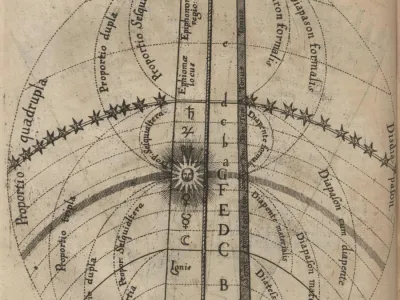
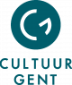
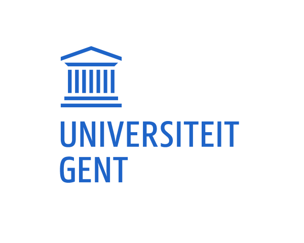

---
hide:
  - title
  - navigation
---

# La Predica del Sole

{align =left}

Galilei’s conflict met de rooms-katholieke kerk, waarbij hij in 1633 zijn geloof in het heliocentrisme moest ontkennen en onder huisarrest werd geplaatst, is een populair archetype geworden voor de historische relatie, lees: onverenigbaarheid, tussen wetenschap en geloof.

In deze originele combinatie van een lezing en een concert brengen we Galilei samen met religieuze muziek uit zijn tijd. Ze ontmoeten elkaar in hun bijzondere aandacht voor de zon. De zon was immers tegelijkertijd een natuurlijk object voor astronomische observatie en een spiritueel symbool voor verlichting. De lezing zal nieuw historisch licht werpen op het werk van Galilei en de astronoom in gesprek brengen met de religieuze retoriek.

Het project wil geloof en wetenschappelijk denken in dialoog brengen. We hopen het publiek kritisch te laten nadenken over hun verhouding tot spiritualiteit en rationeel denken. Is het mogelijk voor beide open te staan of zijn ze onverenigbaar? Kunnen wetenschappers ook gelovige mensen zijn? Het wetenschappelijk denken wordt door de meerderheid van de Westerse bevolking ondersteund en aanvaard. Blijft er ruimte om ook het religieuze denken en de spirituele zoektocht van mensen te waarderen? Kunnen nieuwe ideeën die wetenschappers naar voren schuiven over natuur en mens ons daarbij helpen?

Een project in samenwerking met Prof. Maarten Van Dyck van Universiteit Gent. 

## Performers

- Caroline Cajot, sopraan
- Nicholas Cornia, artistieke leiding
- Isabel Dhallé, viool
- Andrea Gavagnin, contratenor
- Thomas Langlois, luit en theorbe
- Dirk Moelants, violone
- Clemence Schiltz, gamba
- Emi Shiraki, harp
- Maarten Van Dyck, spreker
- Leander Van Gijsegem, tenor
- Katrien Van Winckel, viool
- Lidwien Van Winckel, sopraan
- Veera Voordeckers, klavecimbel

## Media

<iframe width="560" height="315" src="https://www.youtube.com/embed/videoseries?si=7N3zrxwziVKKoFqt&amp;list=PLDTXvtcLnrvGA1fkJKL7146zD4J5pqY4S" title="YouTube video player" frameborder="0" allow="accelerometer; autoplay; clipboard-write; encrypted-media; gyroscope; picture-in-picture; web-share" referrerpolicy="strict-origin-when-cross-origin" allowfullscreen></iframe>

## Partners

- __Stad Gent__

    Met steun van 

    {align=left}
    
    

- __Universiteit Gent__

    Met dank aan Prof. Maarten Van Dyck

    {align=left width=150 height=150}
    

