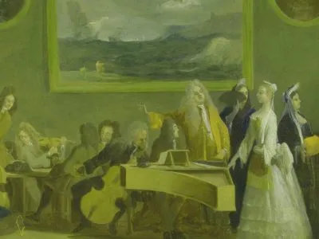

---
hide:
  - title
  - navigation
---

# Sketches of Arcadia

{align =left}

Londen in de 18de eeuw was the place to be voor artiesten en performers op zoek naar rijke werkgevers en mecenassen. Dankzij een bloeiende economie, groeiende industrie, nieuwe inkomsten uit kolonies en een oppermachtige marine groeide Engeland uit tot een welvarende mogendheid binnen Europa en de rest van de wereld. De nieuwe Britse middenklasse profiteerde en kon zich nieuwe vormen van ontspanning permitteren, waarop een bruisende entertainmentsector ontstond met theater, literatuur en muziek.  

Veel Italiaanse kunstenaars uit die periode, onder wie componisten Giovanni Bononcini, Nicola Porpora en Attilio Ariosto, zochten roem en fortuin in de bruisende Noord-Europese metropool. Ook virtuoso instrumentalisten en zangers, zoals zangeres Margherita de l’Épine (afgebeeld op het schilderij Rehearsal of an opera van Marco Ricci, vooraan dit boekje), plaatsten zich in het centrum van het Londense seizoen vol evenementen en geroddel.

Buitenlandse kunstenaars domineerden de Londense scene en brachten eigen kunst en cultuur mee, die regelmatig indruisten tegen de Britse ideologie en esthetiek. Een blik op de resem gearchiveerde klachten over Italiaanse extravagantie en gebrek aan oprechtheid spreekt boekdelen.

Een balsem voor die culturele clash, was de gedeelde liefde van buitenlanders en Engelsen voor de Griekse en Romeinse mythologie en literatuur, met een duidelijke voorkeur voor het Arcadische pantheon van herders, nimfen, saters en goden. Pastorale verhalen over liefde, natuur en eenvoud in een idyllisch land, die zowel terug te vinden waren bij de antieke schrijvers als in Schotse en andere lokale volksvertellingen vielen bij iedereen in goede aarde. De hunkering naar eenvoud en natuur zou in de romantische beweging volledig tot wasdom komen, in reactie op de groeiende invloed van industrie en wetenschap in de eeuw van de verlichting.

Een favoriet muziekinstrument in de Britse gentlemen’s clubs was de fluit, en dan in het bijzonder de traverso of German flute. De klank herinnert aan de panfluiten van Arcadische herders en saters. De immense populariteit blijkt uit de talrijke fluittranscripties van bekende melodieën in muziekcollecties en -magazines. 

Sketches of Arcadia blaast een aantal van de vroeg 18de eeuwse cantates en liederen, met Arcadia als gezamenlijk thema, nieuw leven in. De Italian manner, even aanlokkelijk als controversieel, inspireerde een generatie Engelse schrijvers en componisten in samenwerking met artiesten uit continentaal Europa.

## Uitvoerders

- Patrick Beukels, traverso
- Florian Heyerick, klavecimbel
- Dirk Moelants, gamba
- Jana Pieters, sopraan
- Arina Tsytlenok, traverso

## Media

<iframe width="560" height="315" src="https://www.youtube.com/embed/videoseries?si=EK7TUQT3wwqoYK_g&amp;list=PLDTXvtcLnrvEIwoM-GZGH0jvztRFmg7cF" title="YouTube video player" frameborder="0" allow="accelerometer; autoplay; clipboard-write; encrypted-media; gyroscope; picture-in-picture; web-share" referrerpolicy="strict-origin-when-cross-origin" allowfullscreen></iframe>

